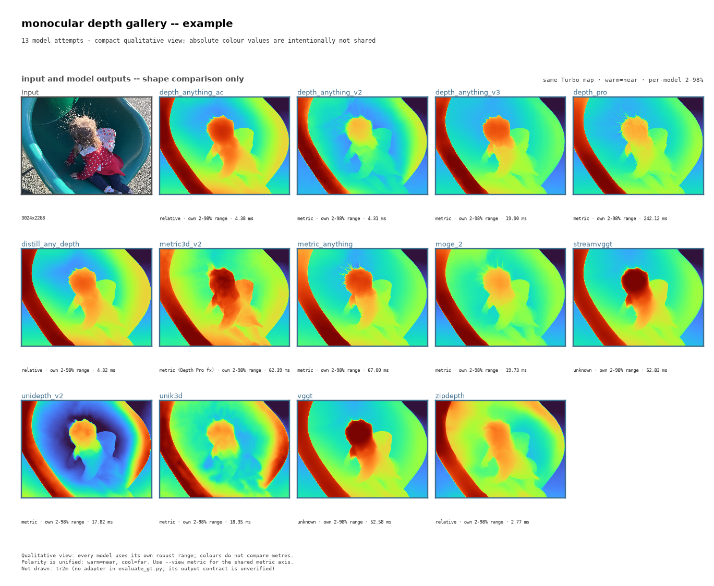

# Monocular Depth Estimation → TensorRT

This repository converts 14 monocular depth models to TensorRT and compares them under documented conditions. The models do not share one output contract: input sizes range from 384×512 to 1536×1536, and outputs may be metric depth, relative depth, canonical depth, point maps, or geometry. Read the output semantics before comparing speed or accuracy.

| Item | Reference |
| --- | --- |
| Measurement host | NVIDIA RTX 3080, TensorRT 10.16.1.11, GPU clock locked at 1800 MHz |
| Speed results | [`reports/comparison.md`](reports/comparison.md) |
| Ground-truth accuracy | [`reports/gt.md`](reports/gt.md), DIODE indoor subset |
| Engine validation | [`reports/accuracy.md`](reports/accuracy.md) |

## Repository layout

| Path | Purpose |
| --- | --- |
| `models/<name>/` | Model specification, ONNX export, TensorRT build script, and model README |
| `core/` | Shared preprocessing, benchmarking, evaluation, build, and visualization code |
| `tools/` | Executable utilities; see [`tools/README.md`](tools/README.md) |
| `tools/retired/` | Historical experiment drivers kept for provenance |
| `reports/` | Generated measurements and audit tables; JSON is the source of truth |
| `tests/` | Regression tests |
| `docs/` | Methodology, setup notes, and model contracts |

## Quick start

```bash
conda create -n trte python=3.11 --yes
conda activate trte
pip install torch torchvision torchaudio --index-url https://download.pytorch.org/whl/cu128
pip install "tensorrt-cu12<11" "cuda-python<13" onnx opencv-python matplotlib
```

TensorRT 11 is not supported. These scripts select precision through the TensorRT 10 builder flags, which were removed or changed by the strongly typed TensorRT 11 API. Model export environments and the TensorRT build environment are intentionally separate; `run.py` reads each model's `spec.json` to select the correct environment.

## Common commands

```bash
python run.py export unidepth_v2
python run.py build unidepth_v2
python run.py build --all --dry-run

python demo.py
python demo.py --synthetic
python tools/models.py --stale
python tools/compare.py --check
python tools/evaluate_gt.py
python tools/verify_accuracy.py
```

Model encoder, resolution, and precision choices are constants in the model scripts. Change the export and build scripts together, then rebuild and remeasure.

## Registered models

| Model | Input | Output contract | Model documentation |
| --- | ---: | --- | --- |
| Depth Anything V2 | 518×518 | Metric (Hypersim checkpoint) or relative | [README](models/depth_anything_v2/README.md) |
| Depth Anything V3 | 518×518 | Metric depth plus sky mask | [README](models/depth_anything_v3/README.md) |
| Depth Anything AC | 518×518 | Relative depth | [README](models/depth_anything_ac/README.md) |
| Distill Any Depth | 518×518 | Relative depth | [README](models/distill_any_depth/README.md) |
| ZipDepth | 384×512 | Affine-invariant inverse depth | [README](models/zipdepth/README.md) |
| Depth Pro | 1536×1536 | Metric depth plus focal length | [README](models/depth_pro/README.md) |
| Metric3D V2 | 616×1064 | Canonical depth; not metres without calibration | [README](models/metric3d_v2/README.md) |
| Metric Anything | 388×518 | Point map plus metric scale | [README](models/metric_anything/README.md) |
| MoGe-2 | 388×518 | Point map plus metric scale | [README](models/moge_2/README.md) |
| UniDepth V2 | 672×896 | Point map plus intrinsics | [README](models/unidepth_v2/README.md) |
| UniK3D | 672×896 | Point map plus intrinsics | [README](models/unik3d/README.md) |
| TR2M | 434×560 | Text-conditioned metric depth | [README](models/tr2m/README.md) |
| VGGT | 518×518 | Geometry with unknown global scale | [README](models/vggt/README.md) |
| StreamVGGT | 518×518 | Geometry with unknown global scale | [README](models/streamvggt/README.md) |

Available encoders and checkpoint variants are listed in each model README. “Available” means that this repository has verified both an upstream checkpoint and a loader for the variant; a class name or a “coming soon” checkpoint does not qualify. The current tables measure only the selected variant.

## Visualization

```bash
python demo.py --live --image data/example.jpg --out reports/demo/example
python demo.py --live --view metric --metric3d-fx-from-depth-pro \
  --image data/example.jpg --out reports/demo/metric
```

The default gallery uses the same `turbo` colormap and an independent 2–98% display range per panel. It is suitable for qualitative shape comparison, not for reading metres from colours. Metric3D can use a measured `--fx`; the optional `--metric3d-fx-from-depth-pro` path uses Depth Pro's predicted horizontal FOV to derive an estimated focal length and labels it as such. TR2M requires a per-image text prompt and is therefore omitted from the generic gallery.



## Performance and licensing

The benchmark table in this README is generated from `reports/*.json`; do not edit the generated section by hand. Speed values from different input-size groups are not directly comparable. See [`reports/comparison.md`](reports/comparison.md) for p90/p99 values and caveats.

<!-- BENCH:BEGIN -->
Measured on NVIDIA GeForce RTX 3080, TensorRT 10.16.1.11, on `data/example.jpg`.
Generated by `compare.py` — do not edit between the markers.

**Input 518x518**

| model               | precision | mean ms | p50   | fps    | output                       |
| --- | --- | ---: | ---: | ---: | --- |
| `depth_anything_v2` | fp16      | 4.31    | 4.31  | 232.11 | metric (hypersim) by default |
| `distill_any_depth` | fp16      | 4.32    | 4.32  | 231.47 | relative                     |
| `depth_anything_ac` | fp16      | 4.38    | 4.37  | 228.47 | relative                     |
| `depth_anything_v3` | fp16      | 19.90   | 19.89 | 50.26  | metric + sky mask            |
| `vggt`              | fp16      | 52.58   | 52.58 | 19.02  | geometry (scale unknown)     |
| `streamvggt`        | fp16      | 52.83   | 52.82 | 18.93  | geometry (scale unknown)     |

**Input 388x518**

| model             | precision | mean ms | p50   | fps   | output                   |
| --- | --- | ---: | ---: | ---: | --- |
| `moge_2`          | fp16      | 19.73   | 19.72 | 50.68 | point map + metric_scale |
| `metric_anything` | fp16      | 67.00   | 66.99 | 14.93 | point map + metric_scale |

**Input 672x896**

| model         | precision | mean ms | p50   | fps   | output                 |
| --- | --- | ---: | ---: | ---: | --- |
| `unidepth_v2` | fp16      | 17.82   | 17.82 | 56.12 | point map + intrinsics |
| `unik3d`      | fp16      | 18.35   | 18.34 | 54.51 | point map + intrinsics |

**Input 1536x1536**  (only model at this size)

| model       | precision | mean ms | p50    | fps  | output |
| --- | --- | ---: | ---: | ---: | --- |
| `depth_pro` | fp16      | 242.12  | 242.17 | 4.13 | metric |

**Input 384x512**  (only model at this size)

| model      | precision | mean ms | p50  | fps    | output                   |
| --- | --- | ---: | ---: | ---: | --- |
| `zipdepth` | fp16      | 2.77    | 2.68 | 361.40 | relative (inverse depth) |

**Input 434x560**  (only model at this size)

| model  | precision | mean ms | p50   | fps   | output                    |
| --- | --- | ---: | ---: | ---: | --- |
| `tr2m` | fp16      | 20.08   | 20.08 | 49.80 | metric (text-conditioned) |

**Input 616x1064**  (only model at this size)

| model         | precision | mean ms | p50   | fps   | output                                            |
| --- | --- | ---: | ---: | ---: | --- |
| `metric3d_v2` | fp32      | 62.39   | 62.39 | 16.03 | canonical (not metres; needs a real focal length) |

Speeds do **not** compare across those groups: attention cost grows faster than pixel count, so a model at a smaller input is not therefore faster. Full table with p90/p99 and the per-model caveats: [reports/comparison.md](reports/comparison.md).
<!-- BENCH:END -->

The conversion scripts are MIT licensed. Upstream model code and weights retain their own licenses, which are documented in each model README. Check the upstream license before commercial use; several weights are non-commercial or have no license file.

## Documentation

- [`docs/setup.md`](docs/setup.md): environment and operational pitfalls
- [`docs/demo.md`](docs/demo.md): demo and visualization usage
- [`docs/model_contracts.md`](docs/model_contracts.md): inputs, preprocessing, outputs, and setup contracts
- [`docs/findings.md`](docs/findings.md): measured findings and decisions
- [`docs/history.md`](docs/history.md): completed plans and historical measurements
- [`docs/later_candidates.md`](docs/later_candidates.md): model-candidate review log
